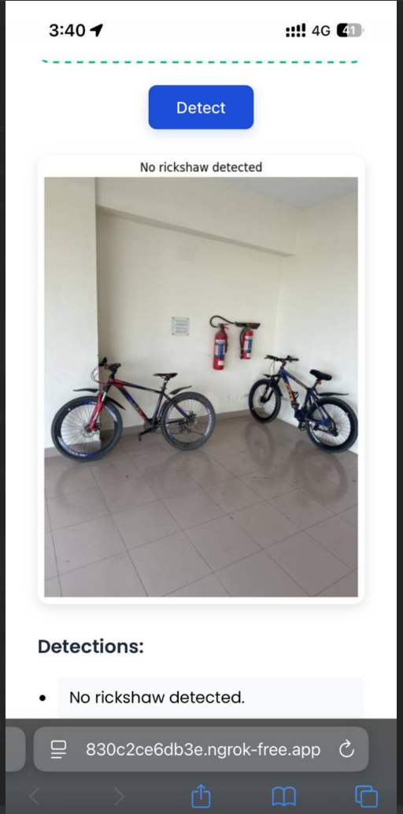
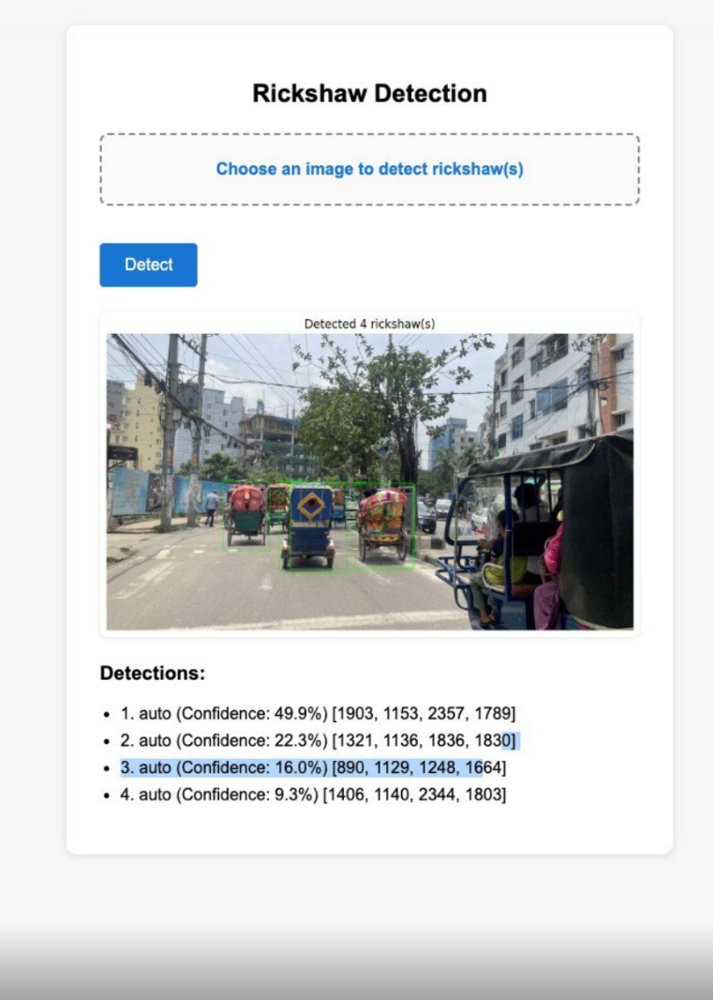
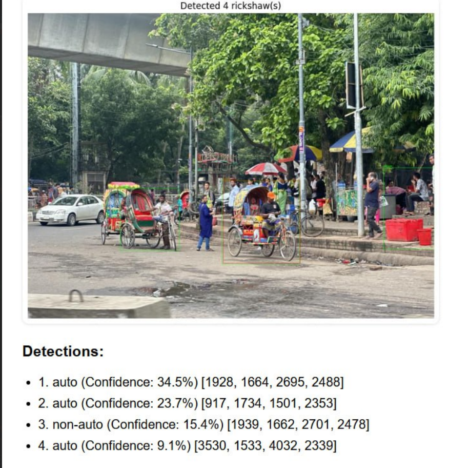

# 🚦 Auto Rickshaw Detection System

📄 **Preprint (arXiv):**  
**Auto Rickshaw Detection in the Wild**  
👉 https://arxiv.org/abs/2510.26154  

---

## 🔍 Overview

This project presents a **YOLO-based object detection system** for detecting **auto rickshaws** in **dense urban traffic scenes**, particularly tailored for **South Asian road environments**.

Unlike generic vehicle detectors, this system focuses on real-world challenges such as **occlusion**, **class imbalance**, and **crowded traffic scenes**, enabling reliable detection for **traffic analytics and smart-city applications**.

---

## 🧠 Key Challenges Addressed

- **Occlusion:** Auto rickshaws are often partially hidden by buses, cars, or pedestrians.
- **Class Imbalance:** Auto rickshaws appear much less frequently than other vehicles.
- **Dense Urban Traffic:** Overlapping objects and cluttered scenes.

These challenges are handled through **dataset curation, annotation strategy, data augmentation, and careful YOLO training design**.

---

## ✨ Features

- Detects **auto rickshaws** in real-world traffic images
- Robust to **occlusion and dense traffic**
- Supports **multiple detections per image**
- Outputs **confidence scores and bounding boxes**
- Lightweight inference suitable for deployment
- Visualizes detection results

---

## 🖼️ Sample Results

  
  
  

---

## 📁 Repository Structure

Auto_Rickshaw_detection/
├── assest/ # Sample result images
├── inference.py # Inference script
├── rickshaw_detection.py # Training pipeline
├── main.py # Entry point
├── frontend.html # Simple web demo
├── requirements.txt # Python dependencies
├── README.md

